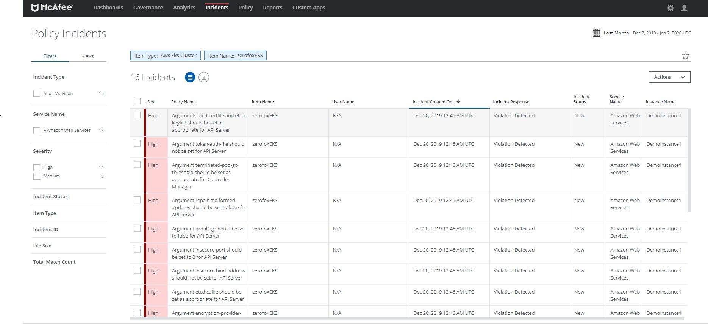
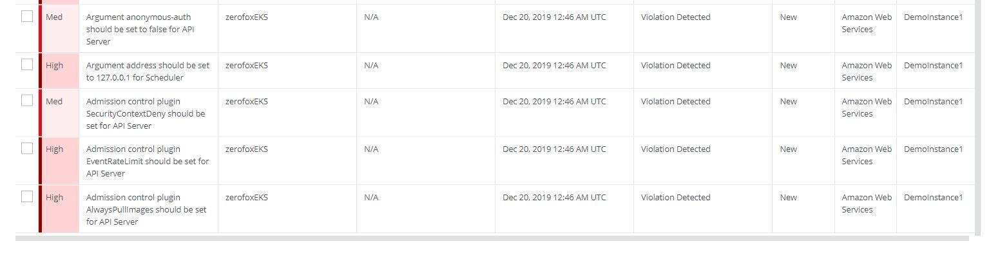

Go to Policy Templates -> Import Configuration Audit Checks for AWS EKS -> Run the configuration audit scan -> Validate your findings under Incidents


Go to Policy Templates --> Import Configuration Audit Checks for AWS EKS -> Run the configuration audit scan -> Validate your findings under Incidents






```

